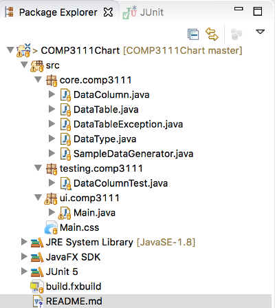
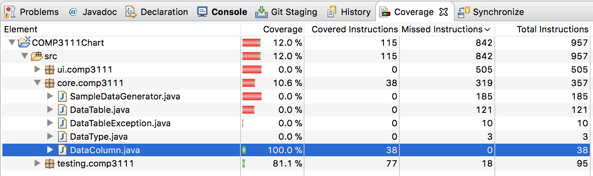

# HKUST COMP3111 Software Engineering (Spring 2018)

This GitHub repo hosts the base code of COMP3111 group project. The following features are provided

- A Java codebase which can be imported to `Eclipse IDE`. 
- Sample data handling classes are implemented in `core.comp3111` package
- A sample JUnit test (DataColumnTest) is implemented in `testing.comp3111` package (with 100% test coverage on DataColumn)
- A sample JavaFx GUI component is implemented in `ui.comp3111` package

Instructions to clone this GitHub project:

- Follow the instructions to [install JavaFx](https://www.eclipse.org/efxclipse/install.html) to your `Eclipse IDE`
- Restart `Eclipse IDE`
- Select `File > Import...`
- Select `Git > Projects` 
- Select `Clone URI` and then click `Next >`
- Copy and paste the URL from the web browser to the text box of `URI`
- Click `Next >` buttons a few times. Accept all default settings.
- Click `Finish` at the end

After importing this GitHub repo, the Eclipse project explorer should be displayed as follows: 

Steps to run the Java GUI application
- Right-click the project folder
- Select `Run As > Java Application`

Steps to run the unit test and generate the coverage report
- Right-click the project folder
- Select `Coverage As > JUnit Test`
- All unit tests in `testing.comp3111` should be executed 
- A coverage report should be generated as follows:

