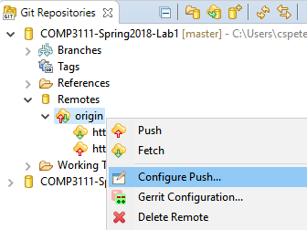

# How to change to a new remote repository in Eclipse?

- Create a new GitHub repository. 
  - Keep it empty. Don't need to create README.
- Open `Git Repositories` window in Eclipse
- Expand your project repository icon 
- Expand `Remotes` icon 
- Right-click `origin` icon
- Select `Configure Push...`
-  
- Change the URI to point to the new GitHub repository
- Click `Save and Push`